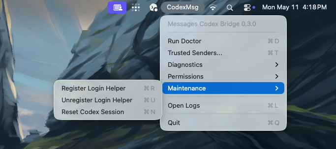

# Messages Codex Bridge

Messages Codex Bridge is a native macOS menu-bar app that lets trusted Apple
Messages send prompts to Codex on your Mac and receive replies back in
Messages.



Source-built installs are supported through the Homebrew tap or the local build
script. Maintainer tooling for signed/notarized zip packaging exists in the
repo, but notarized binary releases are not the default public artifact yet.

## Current Distribution Mode

The v0.3.0 release is source-build first:

- Homebrew tap: `brew tap urcades/moss && brew install moss`.
- Local build from this Swift package.
- Local code signing identity when available.
- Ad hoc signing fallback for development/build verification.
- Signed/notarized zip packaging exists for maintainers with a Developer ID
  certificate, but source build remains the recommended public path.
- The app bundle includes a generated moss icon.

## Prerequisites

- macOS 15 or newer.
- Git.
- Xcode Command Line Tools or a Swift toolchain that can run `swift build`.
- Apple Messages signed in and able to send/receive the account you want to use.
- Codex.app installed with its bundled CLI available at:

```sh
/Applications/Codex.app/Contents/Resources/codex
```

The bridge uses `codex app-server --listen stdio://` through that CLI. It does
not use the legacy `codex exec` backend.

## Homebrew Source Build

The easiest source-build install is the Homebrew tap:

```sh
brew tap urcades/moss
brew install moss
```

Then finish first-run setup:

```sh
cd ~
mossctl configure --safety standard
moss-open
mossctl doctor
```

`moss-open` launches the menu-bar app from Homebrew's install prefix.
`mossctl` is the bridge control CLI for status, Doctor, safety configuration,
and maintenance commands.

If you want fresh runtime config to default Codex sessions to a specific working
directory, run `mossctl configure` from that directory before `moss-open`, or
launch with:

```sh
MOSS_CODEX_CWD=/path/to/workspace moss-open
```

## Local Source Build

Clone the repository and build the app:

```sh
git clone https://github.com/urcades/moss.git
cd moss
./BuildSupport/install-local-app.zsh
```

The installer builds the app, asks for a runtime safety profile, copies the app
to `~/Applications/MessagesCodexBridge.app`, and opens that installed copy.

Safety profiles:

- `standard`: recommended for source-build installs. Outgoing attachments are
  restricted to normal image/PDF files under home or temp paths, and permission
  broker auto-clicking is off.
- `permissive`: personal dogfooding mode. Outgoing attachments have full file
  access, and permission broker auto-clicking is on.
- `preserve`: keep existing safety settings while migrating or creating config.

For non-interactive installs:

```sh
./BuildSupport/install-local-app.zsh --safety standard
./BuildSupport/install-local-app.zsh --safety permissive
./BuildSupport/install-local-app.zsh --safety preserve
```

The lower-level build script still creates:

- `.build/app/MessagesCodexBridge.app`
- A bundled login helper at `Contents/Library/LoginItems/MessagesCodexBridgeHelper.app`
- A bundled permission broker at `Contents/Library/LoginItems/MessagesCodexPermissionBroker.app`

If no `SIGN_IDENTITY` is provided, the build script uses the local
`Messages Codex Bridge Local Code Signing` identity when present. Otherwise it
falls back to ad hoc signing, which is enough for source-build development.

To create the local signing identity first:

```sh
./BuildSupport/create-local-signing-identity.zsh
./BuildSupport/install-local-app.zsh
```

## First Run

When the menu-bar app opens, its menu header should read:

```text
Messages Codex Bridge 0.3.0
```

Use the menu in this order:

1. Open `Trusted Senders...`.
2. Add the phone number or Apple ID email that is allowed to send prompts.
3. Run `Run Doctor`.
4. Use the permission settings menu items that Doctor asks for.
5. Send `/status` from the trusted sender.
6. Send a normal prompt from the trusted sender.

Fresh installs start with no trusted senders. In that state the bridge can run,
but it ignores inbound Messages until you add at least one trusted sender.

## Menu

The app intentionally stays small. The menu contains the operational controls:

- `Run Doctor`
- `Trusted Senders...`
- `Diagnostics`: Computer Use probe, Doctor report copy, and permission broker status/actions.
- `Permissions`: System Settings shortcuts for required macOS privacy grants.
- `Maintenance`: login helper registration and Codex session reset.
- `Open Logs`
- `Quit`

`Trusted Senders...` opens a plain native list window with `+` and `-` controls.
Changes save immediately to the runtime config and do not require restarting the
helper.

## Runtime Paths

The Swift bridge preserves the existing runtime locations:

- `~/Library/Application Support/MessagesLLMBridge/`
- `~/Library/Logs/MessagesLLMBridge/`

Important runtime files:

- `config.json`: trusted senders, Codex paths, bridge options.
- `state.json`: active session/job state.
- `messages-bridge-swift.log`: helper logs.

## Security And Privacy

This app runs locally on your Mac. After you grant permissions, it can read the
local Messages database, send replies through Messages, and invoke Codex on
prompts sent by trusted senders.

The standard safety profile keeps outgoing attachments restricted and leaves
permission broker auto-clicking off. The permissive profile is available for
personal dogfooding and should be treated as a broad local-automation mode.

See `SECURITY.md` for the security policy and `docs/KNOWN_LIMITATIONS.md` for
current limitations.

## Uninstall

For Homebrew installs:

```sh
brew uninstall moss
```

For local source builds, run `./BuildSupport/uninstall-local-app.zsh --dry-run`
to preview the teardown path. See `docs/UNINSTALL.md` for full runtime cleanup
details.

## Permissions

Do not edit TCC databases directly. Use `Run Doctor`, `Computer Use Probe`, and
the menu's System Settings shortcuts.

The bridge may need:

- Full Disk Access: read the local Messages database.
- Automation for Messages: send replies through Messages.
- Automation to `com.openai.sky.CUAService`: run Codex Computer Use when asked.
- Accessibility: allow Codex/Computer Use and the permission broker to operate local UI.
- Screen Recording: allow Computer Use to inspect the screen.

Permissions are not auto-granted by the app. The app opens the relevant System
Settings panes and reports missing permissions through Doctor.

More help:

- `docs/TROUBLESHOOTING.md`
- `docs/PRIVACY_AND_SECURITY_FAQ.md`
- `docs/SIGNING_AND_NOTARIZATION.md`
- `docs/HOMEBREW.md`
- `docs/ARCHITECTURE.md`
- `docs/ROADMAP.md`

## Control Commands

Send these exact messages from a trusted sender:

- `/status`: compact bridge status.
- `/codex status`: active Codex thread id/link, active job state, progress, and capability status.
- `/codex open`: open the active Codex thread in Codex.app.
- `/codex history`: summarize the last loaded turns from the active Codex thread.

All other text from a trusted sender is treated as a prompt for Codex.

## Development And Validation

Useful development commands:

```sh
swift build
swift test
swift run BridgeCoreSelfTest
swift run BridgeCoreTests
swift run codexmsgctl-swift status
swift run codexmsgctl-swift configure --safety standard
swift run codexmsgctl-swift doctor
./BuildSupport/build-app.zsh
```

The runtime backend is app-server only. If you are debugging Codex behavior,
start from `CodexAppServerBackend` and `CodexAppServerSupport.swift`.

The release validation checklist lives in `RELEASE_CHECKLIST.md`.
